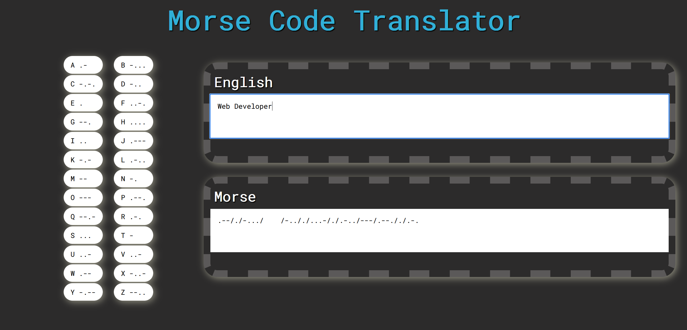
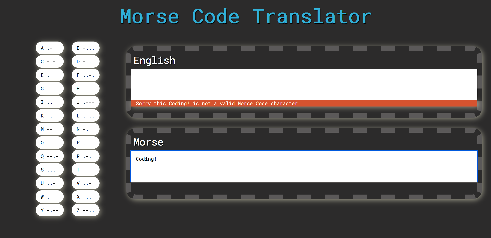
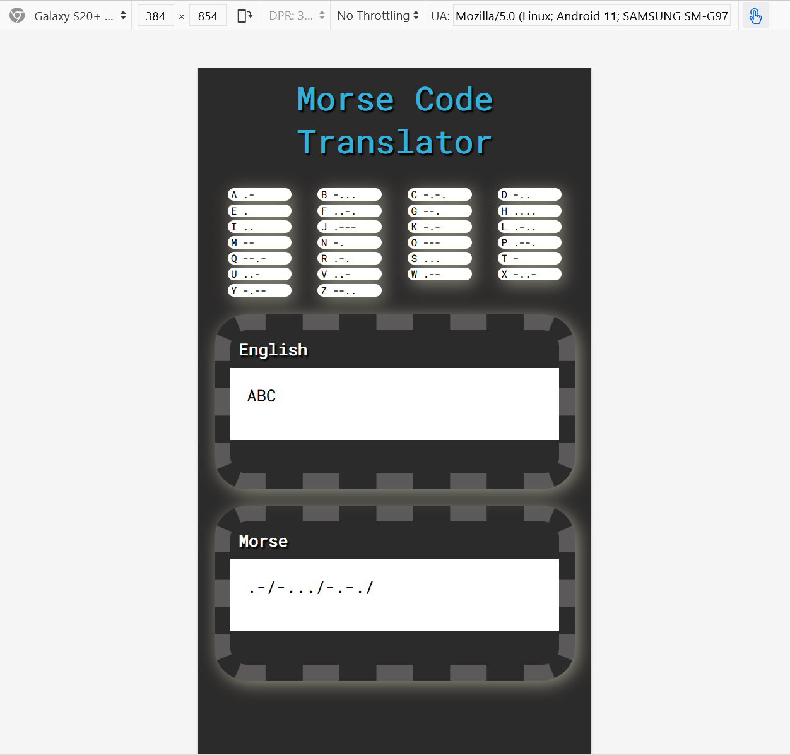
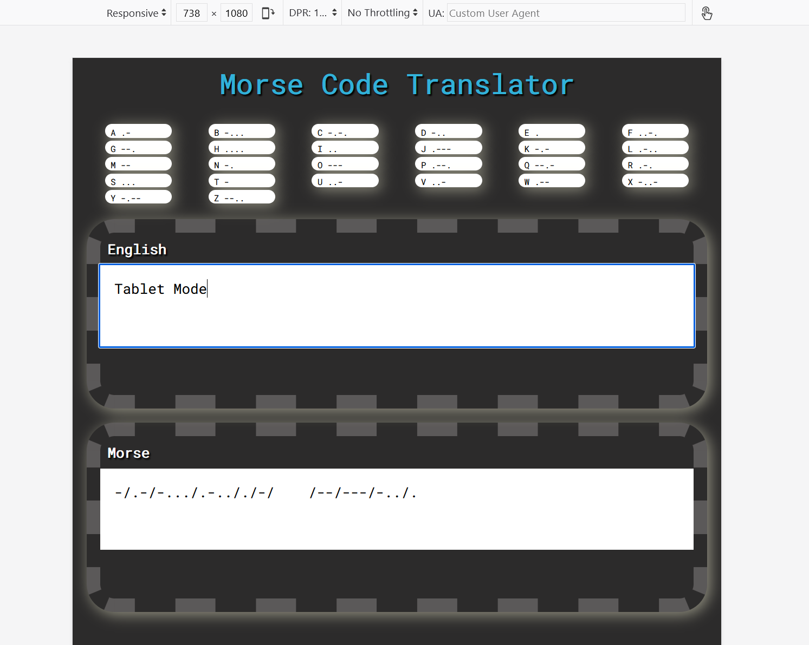

# Morse-Code-Translator

## **Table of Contents** 

  - [**Table of Contents**](#table-of-contents)
  - [**Description**](#description)
  - [**Functionality**](#functionality)
  - [**My experience**](#my-experience)
  - [**Technologies Used**](#technologies-used)
  - [**Preview**](#preview)
  - [**Deployed link**](#deployed-link)
  - [**Future Development**](#future-development)
  - [**Questions**](#questions)

## **Description**
The Morse translator project is an application created to translate letters/words from the English alphabet to Morse Code and vice versa.

The main topic to be implemented was Test-Driven Development (TDD) and Unit Testing using Jest.

**Test-driven development (TDD)**

**1. What is TDD?**  
		- Test Driven Development.  
		- Writting the test before wrtting the code.

**2.  Why do we test our code?**  
		- Give us confidence that it works correctly.  
		- It helps when collaborating with other developers as it makes sure the code we wrote works, and that it doesn't break other parts of the code.

## **My experience**

Writing the test for each function was a rich experience as I was able to find out that the letter "V" was missing from my JavaScript dictionary object. Also running tests gave me the confidence to ensure that the functions were correctly implemented and that any change that I made to the code would be guaranteed to be functioning as expected.

## **Functionality**

Each Morse character is divided by the  "/" symbol to indicate where the character ends. To add a space between Morse words you need to include 4 spaces "&nbsp;&nbsp;&nbsp;&nbsp;".

Some examples:

* Marcela --/.-/.-./-.-././.-../.-
* Web Developer .--/./-.../&nbsp;&nbsp;&nbsp;&nbsp;/-.././...-/./.-../---/.--././.-.
* A B C D E F G H I .-/&nbsp;&nbsp;&nbsp;&nbsp;/-.../&nbsp;&nbsp;&nbsp;&nbsp;/-.-./&nbsp;&nbsp;&nbsp;&nbsp;/-../&nbsp;&nbsp;&nbsp;&nbsp;/./&nbsp;&nbsp;&nbsp;&nbsp;/..-./&nbsp;&nbsp;&nbsp;&nbsp;/--./&nbsp;&nbsp;&nbsp;&nbsp;/..../&nbsp;&nbsp;&nbsp;&nbsp;/..

## **Technologies Used**

* HTML
* Sass/Scss
* CSS
* JavaScript
* Jest
* Test-Driven Development (TDD)

## **Preview**

* **Desktop Mode**

* **Desktop Mode - Showing Error**

* **Mobile Mode**

* **Tablet Mode**

## **Deployed link**

💡 Live version: [click here!]()

## **Future Development**

* Include different lenguages, e.g. letters from Spanish such as "ñ".

## **Questions**

* Contact me on my GitHub profile: [Marcela's GitHub](https://github.com/marcelamejiao)